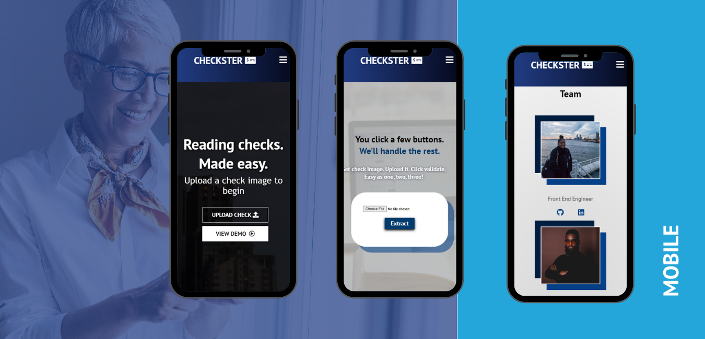

### 
<!-- PROJECT SHIELDS -->
<!--
*** I'm using markdown "reference style" links for readability.
*** Reference links are enclosed in brackets [ ] instead of parentheses ( ).
*** See the bottom of this document for the declaration of the reference variables
*** for contributors-url, forks-url, etc. This is an optional, concise syntax you may use.
*** https://www.markdownguide.org/basic-syntax/#reference-style-links
-->
[![Contributors][contributors-shield]][contributors-url]
[![Forks][forks-shield]][forks-url]
[![Stargazers][stars-shield]][stars-url]
[![Issues][issues-shield]][issues-url]
[![MIT License][license-shield]][license-url]


<!-- PROJECT LOGO -->
<br />
<p align="center">
  <a href="https://github.com/HaxagonusD/Get-Them-Checks">
    
  </a>

  <h1 align="center">Checkster</h1>

  <p align="center">
    Reading Checks. Made Easy.
    <br />
    <a href="https://github.com/HaxagonusD/Get-Them-Checks"><strong>🔍Explore the docs »</strong></a>
    <br />
    <br />
    <a href="https://drive.google.com/file/d/19d-jW-OWbmJs9IbzI-d6IqU58TS1DkR2/view?usp=sharing">👀 View Demo</a>
    ·
    <a href="https://github.com/HaxagonusD/Get-Them-Checks">🐛Report Bug</a>
    ·
    <a href="https://github.com/HaxagonusD/Get-Them-Checks">✍🏽Request Feature</a>
  </p>
</p>


<!-- TABLE OF CONTENTS -->
<details open="open">
  <summary>Table of Contents</summary>
  <ol>
    <li>
      <a href="#installation">Installation</a>
      <li>
      <a href="#inspiration">Inspiration</a>
      <ul>
        <li><a href="#what-it-does">What It Does</a></li>
         <li><a href="#how-we-built-it">How We Built It</a></li>
      </ul>
    </li>
    <li>
      <a href="#our-journey">Our Journey</a>
      <ul>
        <li><a href="#challenges-we-ran-into">Challenges We Ran Into</a></li>
        <li><a href="#accomplishments">Accomplishments</a></li>
        <li><a href="#what-we-learned">What We Learned</a></li>
      </ul>
    </li>
    <li><a href="#whats-next">What's Next</a></li>
    <li><a href="#built-with">Built With</a></li>
    <li><a href="#acknowledgements">Acknowledgements</a></li>
    <li><a href="#our-team">Our Team</a></li>
  </ol>
</details>


<!-- ABOUT THE PROJECT -->
### Authentication

1. Get a free API Key at [https://cloud.google.com](https://cloud.google.com/vision/docs/setup)
2. Clone the repo
   ```sh
   git clone https://github.com/HaxagonusD/Get-Them-Checks.git
   ```
3. Install NPM packages
   ```sh
   npm install
   ```
4. Make an `authentication.JSON` from Google Cloud Service Account
  
5. Place the `authentication.JSON` in the server folder.
6. NPM Start
    ```sh
    cd into `client` && npm start
    ```
9. Server
    ```sh
    cd into server && `nodemon` `app.js`
    ```

## Inspiration 

## What It Does 

Checkster is a mobile responsive web application that allows users to upload handwritten checks, and with the power of AI, have their checks digitized and validated.  The project was built to solve the automation of handwritten checks in the banking industry.


 <a href="https://github.com/HaxagonusD/Get-Them-Checks">
    
  </a>

We approached the Citi Technology x Virtual Hackathon with the intention of leveling up on our technical skills that we are actively learning  in an intensive web development fellowship.  We strategically chose to work on the problem of automating the digitization of handwritten checks because we were excited for the challenge of having an opportunity to implement Google Vision API in our technical solution.

This experience aligns with our personal ambitions as software engineers, front and backend engineers, and UI/UX engineers.

 <a href="https://github.com/HaxagonusD/Get-Them-Checks">
    
  </a>

## How We Built It 

This project was conceptualized by building wireframes and prototypes using Figma. We then built our project over 48 hours using React JS, JavaScript and CSS on the frontend, and utilized Node, Express JS and Cloud Vision API on the backend. 

## Challenges We Ran Into 

Of course, no hackathon would be complete without its fair share of hiccups! Some of the notable challenges we faced were related to importing and managing dozens of image and media files. There were also minor challenges with resolving merge conflicts with the various repository requests. 

## Accomplishments 

We accomplished the following in a short period of time:

* Two hackathon newbies were christened on our team!
* Architecting a complete project in a short period of time.
* Overall team synergy and cooperation.
* All the awesome work we collectively invested.

## What We Learned 

We learned the following very quickly:

* Accessing & Navigating Google Vision API
* Importing image files with Webpack to components
* Tailwind.CSS

## What's Next 

We are looking foward to many new opportunities in the near future, including;

* Collaborating on new challenging hackathons together
* Completing coding bootcamp
* Deployed link for this project

<!-- BUILT WITH -->
## Built With 

This section should list any major frameworks that you built your project using. Leave any add-ons/plugins for the acknowledgements section. Here are a few examples.

* [JavaScript](https://javascript.com)
* [ReactJS](https://reactjs.org)
* [Express](https://expressjs.com/)
* [NodeJS](https://nodejs.org/en/)
* [Google Vision API](https://cloud.google.com/vision/)
* [CSS](https://www.w3schools.com/Css/)

<!-- ACKNOWLEDGEMENTS -->
## Acknowledgements

* [Figma](https://www.figma.com/)
* [Pexels](https://www.pexels.com/) 
* [Unsplash](https://www.unsplash.com)
* [Img Shields](https://shields.io)
* [FontAwesome](https://fontawesome.com/)
* [Trello](https://www.trello.com/)

<!-- CONTACT -->
## Our Team

* Ayman Omer - [LinkedIn](https://www.linkedin.com/in/ayman-omer-b2429b1ab/)
* Jahaziel Israel - [LinkedIn](https://www.linkedin.com/in/jahazielbenisrael/)
* Julian Quezada - [LinkedIn](https://www.linkedin.com/in/julian-q-379184ba/)
* Leesel Fraser - [LinkedIn](https://www.linkedin.com/in/leesel/)
* Shafee Ahmed - [LinkedIn](https://www.linkedin.com/in/shafeelinks/)


<!-- MARKDOWN LINKS & IMAGES -->
<!-- https://www.markdownguide.org/basic-syntax/#reference-style-links -->
[contributors-shield]: https://img.shields.io/github/contributors/HaxagonusD/Get-Them-Checks
[contributors-url]: https://github.com/HaxagonusD/Get-Them-Checks
[forks-shield]: https://img.shields.io/github/forks/HaxagonusD/Get-Them-Checks
[forks-url]: https://github.com/HaxagonusD/Get-Them-Checks
[stars-shield]: https://img.shields.io/github/stars/HaxagonusD/Get-Them-Checks
[stars-url]: https://github.com/HaxagonusD/Get-Them-Checks
[issues-shield]: https://img.shields.io/github/issues/HaxagonusD/Get-Them-Checks
[issues-url]: https://github.com/HaxagonusD/Get-Them-Checks
[license-shield]: https://img.shields.io/github/license/HaxagonusD/Get-Them-Checks
[license-url]: https://github.com/HaxagonusD/Get-Them-Checks
[product-screenshot]: \src\components\images\img-3.jpg


<!-- GETTING STARTED >
## Getting Started

This is an example of how you may give instructions on setting up your project locally.
To get a local copy up and running follow these simple example steps.

### Prerequisites

This is an example of how to list things you need to use the software and how to install them.
* npm
  ```sh
  npm install npm@latest -g
  ```

<!-- USAGE EXAMPLES ->
## Usage

Use this space to show useful examples of how a project can be used. Additional screenshots, code examples and demos work well in this space. You may also link to more resources.

_For more examples, please refer to the [Documentation](https://example.com)_


<!-- ROADMAP ->
## Roadmap

See the [open issues](https://github.com/othneildrew/Best-README-Template/issues) for a list of proposed features (and known issues).

<!-- CONTRIBUTING ->
## Contributing

Contributions are what make the open source community such an amazing place to be learn, inspire, and create. Any contributions you make are **greatly appreciated**.

1. Fork the Project
2. Create your Feature Branch (`git checkout -b feature/AmazingFeature`)
3. Commit your Changes (`git commit -m 'Add some AmazingFeature'`)
4. Push to the Branch (`git push origin feature/AmazingFeature`)
5. Open a Pull Request


<!-- LICENSE ->
## License

Distributed under the MIT License. See `LICENSE` for more information.


